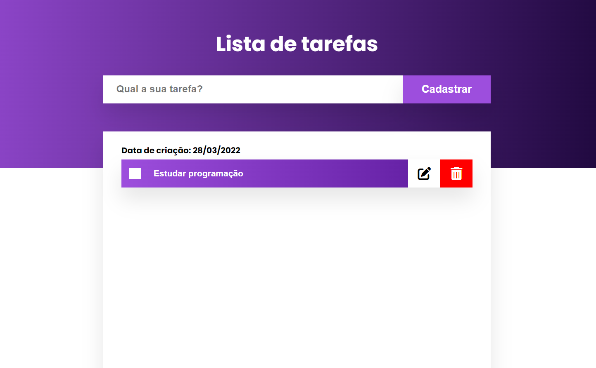
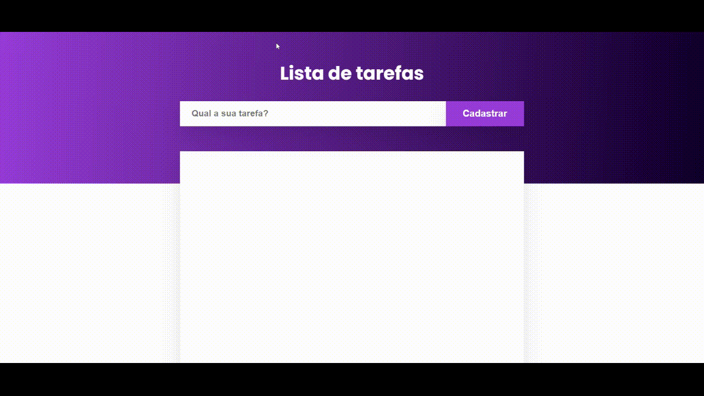

# Lista de tarefas

Nada melhor para dar um up na produtividade do que ter uma lista de tarefas para poder acompanhar. Esse app permite o cadastro de tarefas a edição, exclusão...

## 📋 Funcionalidades

Para utilizar o app basta digitar sua tarefa no campo "Qual a sua tarefa?" e clicar em cadastrar. Ao cadastrar você tem as opções de:
 - Editar tarefa
 - Excluir tarefa
 - Visualizar a data de criação da tarefa
 - Marcar como concluída ou não

## ✅ Tecnologias utilizadas

Para a construção utilizei bastante recursos DOM para manipular os elementos. Utilizei a técnica da programação estruturada dentro da `function taskManager()`. Para mostrar a data de criação da tarefa usei a biblioteca Javascript MomentJS que permite uma manipulação prática e intuitiva de datas.

**Techs:** HTML, CSS, Javascript

## Exemplo de uso

## 🚀 Sobre
Olá eu sou Álvaro Emanuel, desenvolvedor front-end...

Entre em contato: alvarodiasribeiro16@gmail.com

## 🔗 Links

